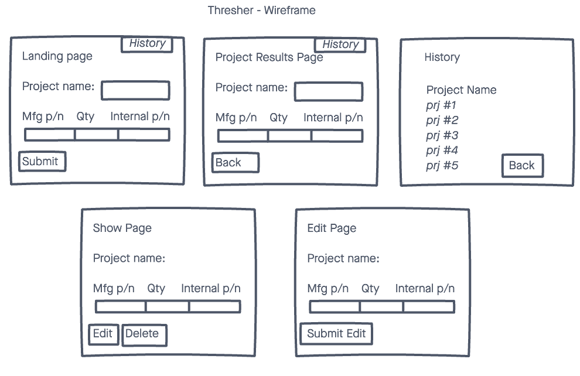

# Thresher EMS Solutions

Designed as a lightweight app to aid in purchasing electronic components for smaller projects.

Intended for use by small Electronics Manufacturing Services (EMS) companies. Typically these contract manufacturers have more established processes for buying for larger qty's, however parts for small R&D projects are often purchaed manually. This app is meant to help streamline these purchases.

# Technologies Used

- HTML
- CSS
- JavaScript
- Node.js
- Express
- EJS
- MongoDB
- Mongoose
- Multer
- Node-xlsx
- Auth0

# Screenshots

# Getting Started
[Click here](https://thresherapp.herokuapp.com/) to see the deployed Project 

# Future Enhancements

- Add pricing by connecting to Mouser.com's API.
- Add option to select options, such as rounding up to next price break if cost is less than selected value.

